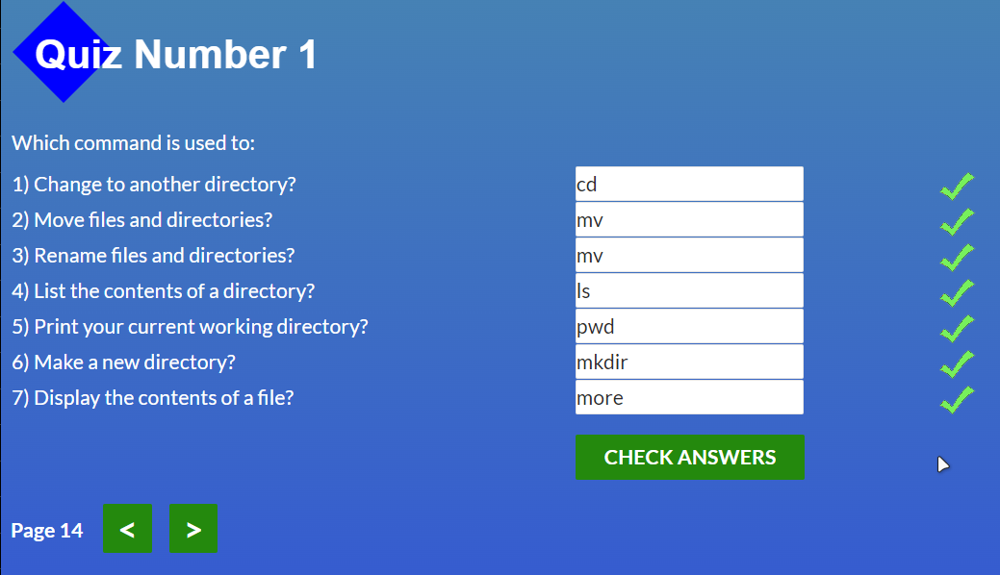
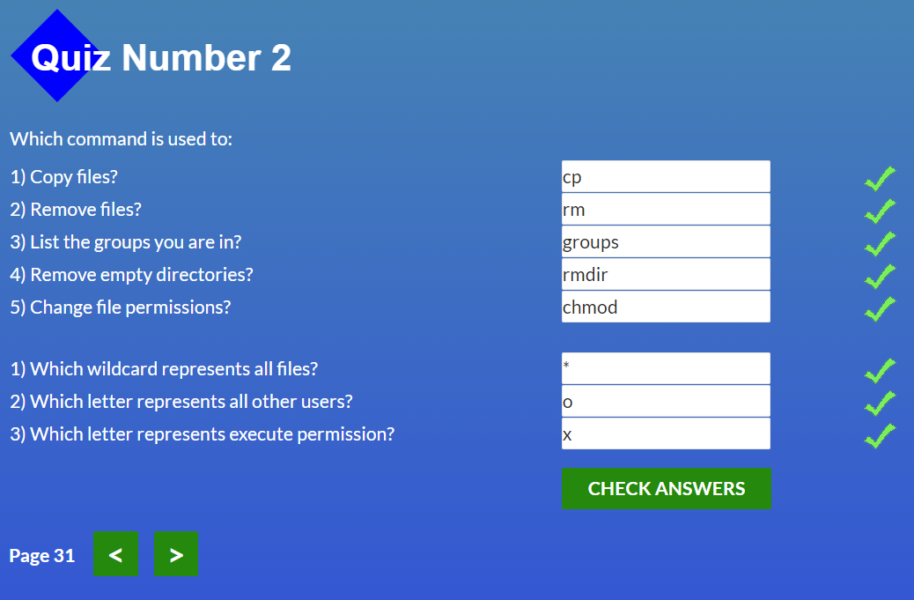
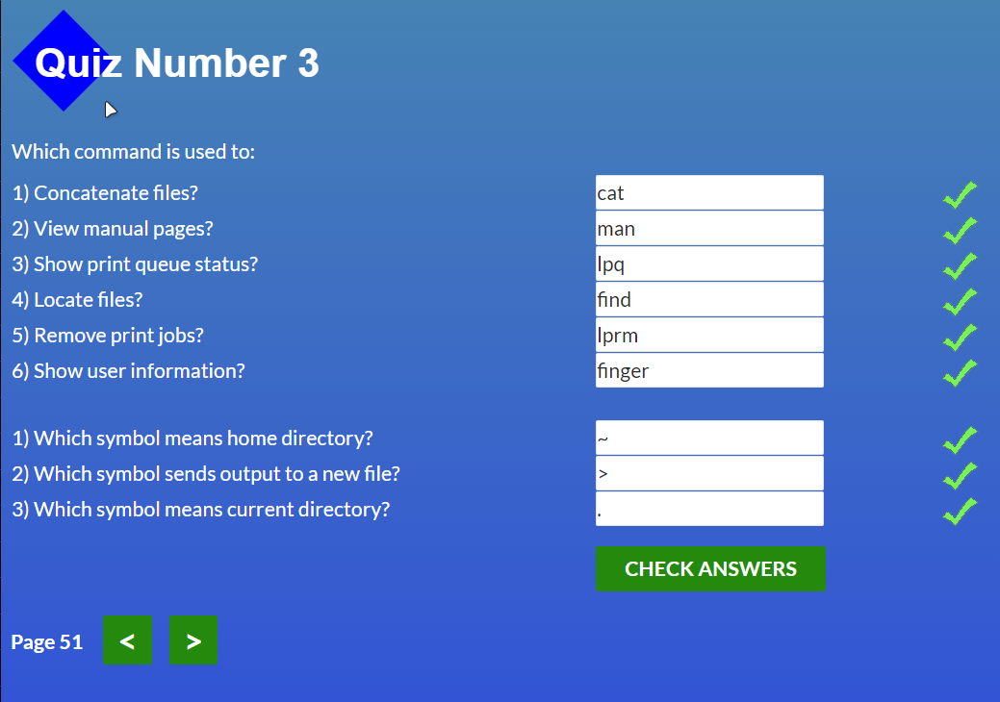
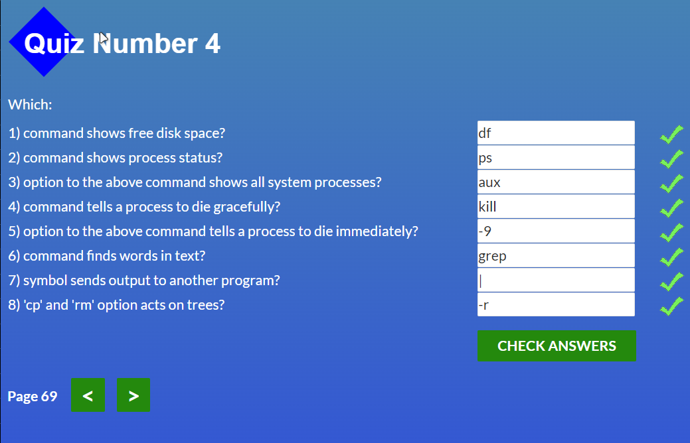

## Hi i'm Denis

<strong>Я вже почав всмоктувати нову інформацію наче Спанч Боб</strong>. Мій курс почався с того, що мій знайомий який був моїм безкоштовним ментором, сказав що якщо я пройду цей ваш курс, то зможу потім одразу кидати заяви на співбесіди в компанії. Ось я й почав, бо мені стало цікаво програмування, а <strong>через те що я в минулому веб дизайнер, я обрав саме Frontend</strong>. Вивчав до цього [html], [css], [scss], [js], [c++]. З VCS сервісом я стикаюсь вперше, тому для мене це щось нове та як я зрозумів, дуже корисне. Через те що я зтикаюсь з ним вперше, він мені був зовсім незрозумілим, якщо честно. Тому я просив мого друга та людей з чату мені допомогти розібратися. Взагалом я розібрався)

Осьо мої результати проходження тестів с <i>нулевого пунку</i> <i>нулевого Стейджу</i>)

Цей квіз мені порадив пройти хлопець з чату, тому я його і пройшов :>
