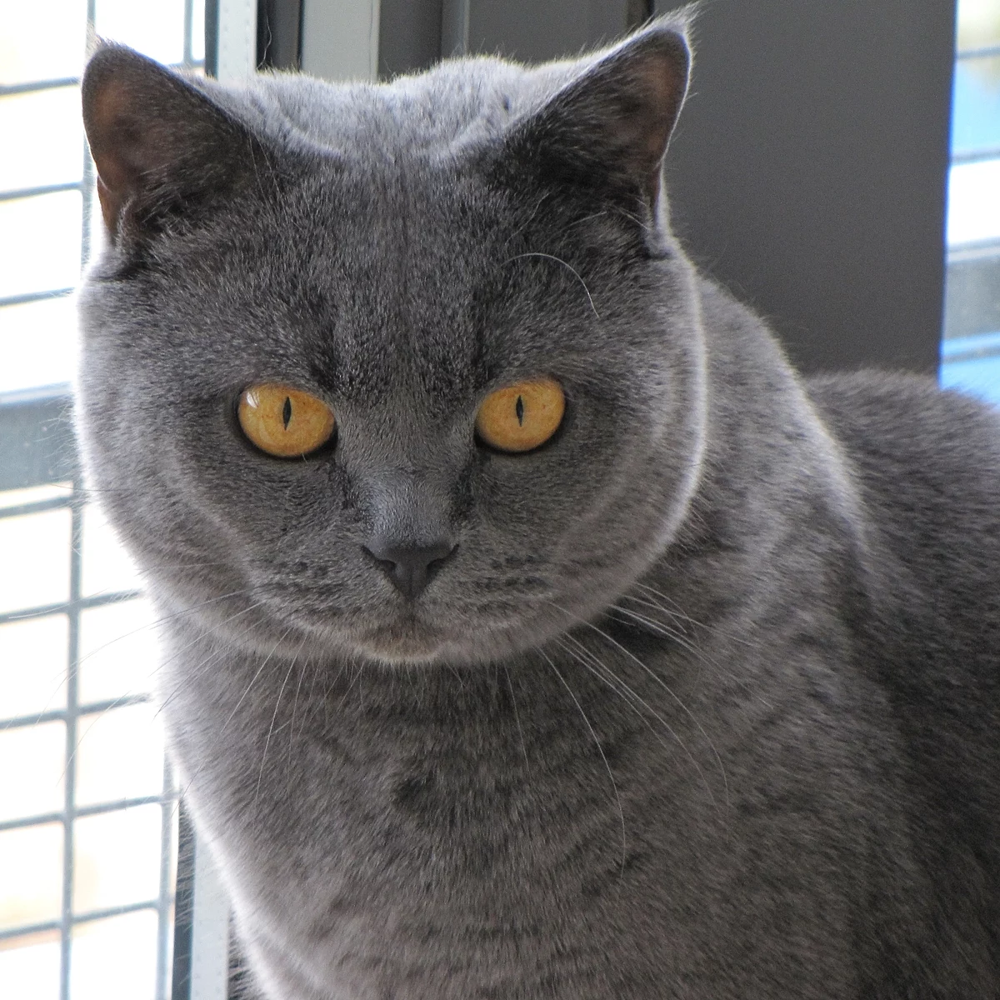
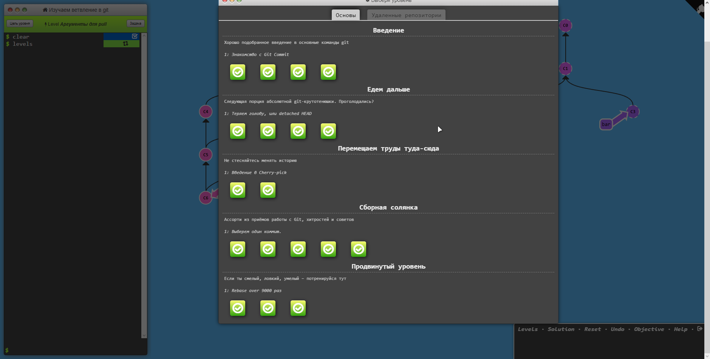
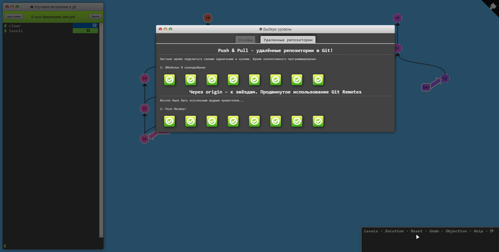
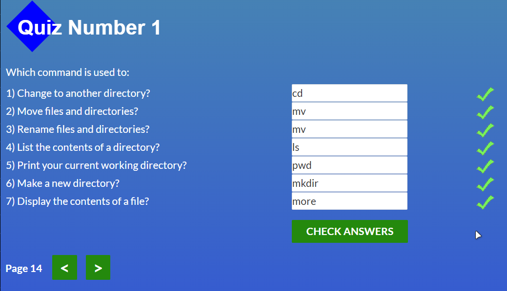
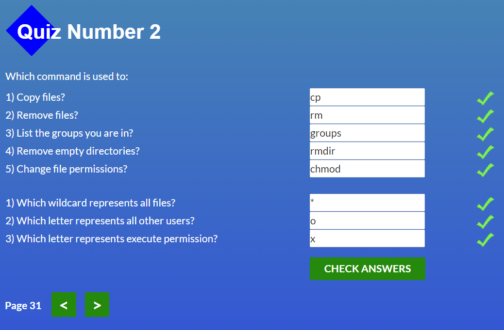
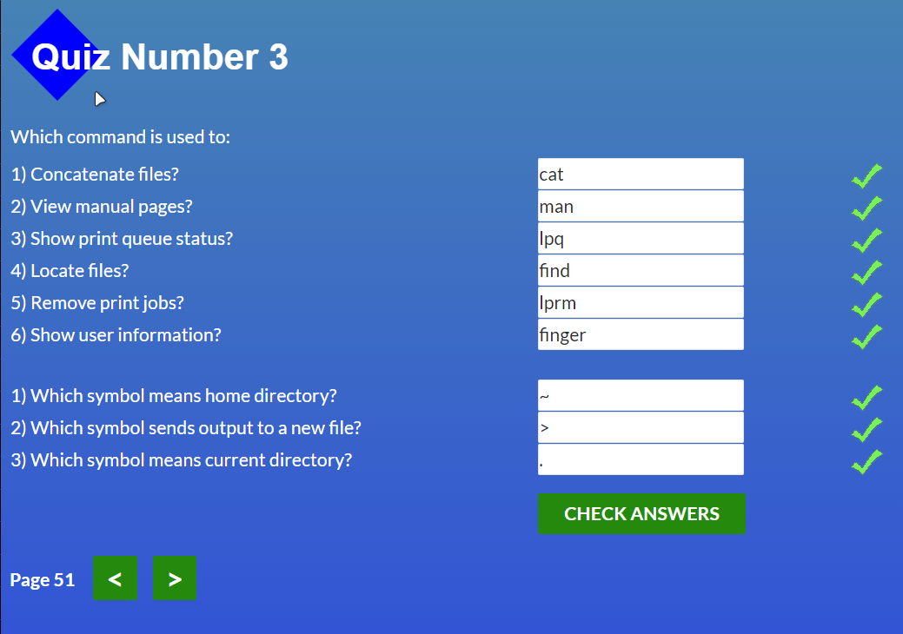
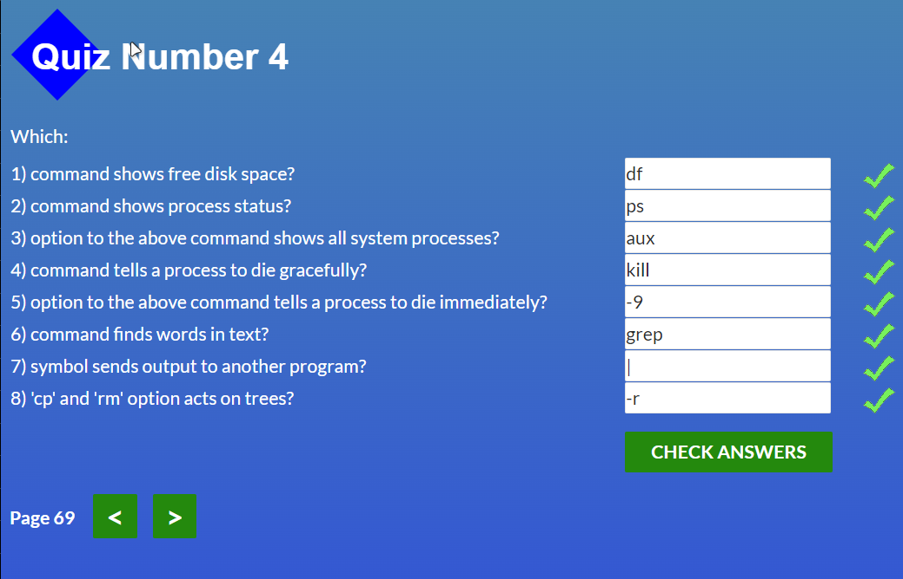

<h1 align="center">Hi there, I'm Denis</a> 
</h1>
<h3 align="center">Computer science student from Ukraine </h3>

<h1 align="center"></h1>

<strong>Я вже почав всмоктувати нову інформацію наче Спанч Боб</strong>. Мій курс почався с того, що мій знайомий який був моїм безкоштовним ментором, сказав що якщо я пройду цей ваш курс, то зможу потім одразу кидати заяви на співбесіди в компанії. Ось я й почав, бо мені стало цікаво програмування, а <strong>через те що я в минулому веб дизайнер, я обрав саме Frontend</strong>. Вивчав до цього [html], [css], [scss], [js], [c++]. З VCS сервісом я стикаюсь вперше, тому для мене це щось нове та як я зрозумів, дуже корисне. Через те що я зтикаюсь з ним вперше, він мені був зовсім незрозумілим, якщо честно. Тому я просив мого друга та людей з чату мені допомогти розібратися. Взагалом я розібрався)

## <a href="https://learngitbranching.js.org/">***GitBranching***</a>
:white_check_mark: Done

# <a	href="https://github.com/kottans/frontend/blob/2022_UA/tasks/linux-cli-http.md">***Linux CLI, and HTTP***</a>
:white_check_mark: Done

## ***Possessed knowledge***
The articles I read about the http and https encryption protocol gave me a lot to understand about the Internet and its security, which in the future will give me more understanding about the work of backends.

## Intro to HTML and CSS
I took the Basic Knowledge Course in HTML and CSS. Honestly, I did not learn anything new, due to the fact that I had previously taken courses on YouTube. It was useful to repeat, not in vain they say repetition is the mother of learning.

Check it out by clicking on the link below and check it out for yourself. 
<a href="https://github.com/denismaysov/kottans-frontend/tree/master/task_html_css_intro">[Тека з скрінами]</a>