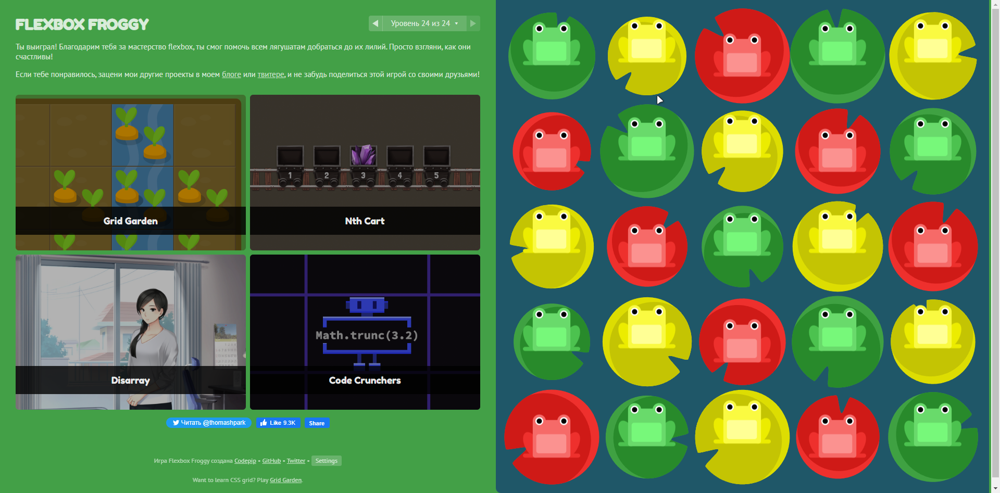
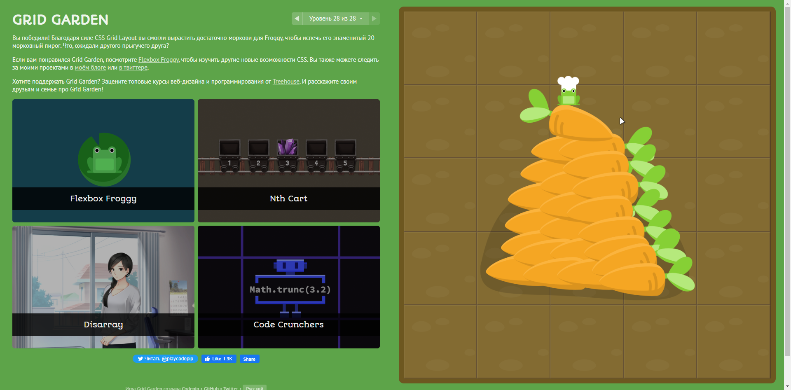

<h1 align="center">Hi there, I'm Denis</a> 
</h1>
<h3 align="center">Computer science student from Ukraine </h3>

<h1 align="center"> Start of my history </h1>

## *Comments*  
  - [X] **General**
    - [X] Git Basic
    - [X] Linux CLI and Networking
    - [X] VCS (hello gitty), GitHub and Collaboration
  - [ ] **Front-End Basics** 
    - [x] Intro to HTML & CSS
    - [x] Responsive Web Design
    - [ ] HTML & CSS Practice
    - [ ] JavaScript Basics
    - [ ] Document Object Model - practice
  - [ ] **Advanced Topics**
	 - [ ] Building a Tiny JS World (pre-OOP) - practice
	 - [ ] Object oriented JS - practice
	 - [ ] OOP exercise - practice
	 - [ ] Offline Web Applications - optional
	 - [ ] Memory pair game — real project!
	 - [ ] Website Performance Optimization - optional
	 - [ ] Friends App - real project

> Я вже почав всмоктувати нову інформацію наче Спанч Боб. Мій курс почався с того, що мій знайомий який був моїм безкоштовним ментором, сказав що ?якщо я пройду цей ваш курс, то зможу потім одразу кидати заяви на співбесіди в компанії. Ось я й почав, бо мені стало цікаво програмування, а через те що я в минулому веб дизайнер, я обрав саме Frontend. Вивчав до цього [html], [css], [scss], [js], [c++]. З VCS сервісом я стикаюсь вперше, тому для мене це щось нове та як я зрозумів, дуже корисне. Через те що я зтикаюсь з ним вперше, він мені був зовсім незрозумілим, якщо 
честно. Тому я просив мого друга та людей з чату мені допомогти розібратися. Взагалом я розібрався).

## [***GitBranching***](https://learngitbranching.js.org/)
:white_check_mark: Done

First page

Second page

## [Linux CLI, and HTTP](https://github.com/kottans/frontend/blob/2022_UA/tasks/linux-cli-http.md)
:white_check_mark: Done

Quiz 1

Quiz 2

Quiz 3

Quiz 4

### ***Possessed knowledge***
The articles I read about the http and https encryption protocol gave me a lot to understand about the Internet and its security, which in the future will give me more understanding about the work of backends.

> Для меня было это очень интересным испытанием на пути к успеху, но довольно таки сложным. Так как я не разу не работал на Линуксе, я сталкивался с его разметкой в первый раз. Выучить я её выучил но пользоваться Линуксом я вряд ли буду.

## Intro to HTML and CSS
:white_check_mark: Done

I took the Basic Knowledge Course in HTML and CSS. Honestly, I did not learn anything new, due to the fact that I had previously taken courses on YouTube. It was useful to repeat, not in vain they say repetition is the mother of learning.

Check it out by clicking on the link below and check it out for yourself. 
<a href="https://github.com/denismaysov/kottans-frontend/tree/master/task_html_css_intro">[Тека з скрінами]</a>

## Responsive Web Design
:white_check_mark: Done

 ***I already knew all the information that was in this paragraph, so it was not difficult for me to complete this task.***

Flex Frogs
 

Grid Garden
 

